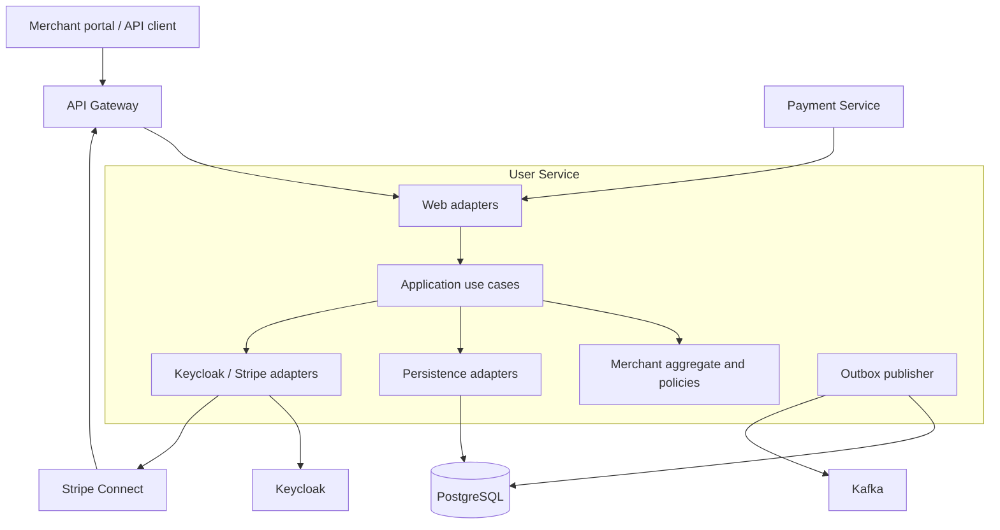

# User Service application architecture

## Responsibility

User Service owns:

- merchant identity and lifecycle state;
- Keycloak identity linkage;
- Stripe Connect account linkage and normalized readiness state;
- the decision whether a merchant is ready for payments and eligible for
  destination charges;
- durable Stripe webhook deduplication;
- production of merchant lifecycle integration events through a transactional
  outbox.

Payment Service consumes the protected internal payment context and must not
trust a merchant or Stripe account ID supplied by an external caller.

## Component view



## Layers

### Domain

The domain contains the `Merchant` aggregate, value objects and payment-state
policies. It has no Spring, JPA, Stripe or Kafka dependencies.

The aggregate:

- normalizes provider state;
- resolves the required merchant action;
- calculates payment readiness and destination-charge eligibility;
- rejects stale provider snapshots;
- returns explicit update results and domain events.

`revision` is an optimistic-concurrency token carried through the detached
domain model. Business rules do not modify or depend on it.

### Application

The application layer coordinates commands, queries and transaction boundaries.
Important flows include:

- merchant registration and onboarding;
- current-merchant and internal payment-context queries;
- Stripe webhook verification, parsing, deduplication and dispatch;
- domain-event dispatch to the transactional outbox.

Webhook concurrency retries are orchestrated by a dedicated `RetryTemplate`.
Each attempt invokes a separate `REQUIRES_NEW` transactional processor.

### Integration

Integration adapters implement:

- JPA persistence for Merchant;
- JDBC persistence and claiming for webhook deduplication and outbox delivery;
- Keycloak Admin API operations;
- Stripe Connect API operations and webhook signature verification;
- Kafka publication;
- REST controllers and security mapping.

`MerchantEntity.revision` uses JPA `@Version`. Hibernate delegates the atomic
compare-and-set to PostgreSQL.

## Transaction boundaries

### Merchant registration

Merchant registration is a staged, forward-recoverable process:

```text
public Keycloak identity registration
→ email verification and OTP
→ Authorization Code with PKCE
→ authenticated Merchant profile creation
→ authenticated Stripe onboarding
```

Identity registration accepts email and the merchant-selected password. User
Service forwards the password directly to Keycloak as a permanent credential;
it does not store it in the Merchant aggregate or local persistence.

New merchant identities are enabled with `emailVerified=false`, the `MERCHANT`
realm role, the managed merchant-origin marker and the `VERIFY_EMAIL` and
`CONFIGURE_TOTP` required actions. Identity registration creates no Merchant or
Stripe resource and issues no authentication tokens.

Merchant profile creation requires a verified authenticated `MERCHANT`.
`identityUserId` and email come from trusted JWT claims; the browser supplies
only business data. Repeating profile creation for the same identity returns
the existing Merchant.

Stripe account creation is a separate authenticated operation. It uses a
stable Merchant-based idempotency key, persists the account ID before issuing
an Account Link and reuses an already linked account.

Provider failures are normalized at the web boundary: password-policy rejection
is `422`, identity conflict is `409`, provider unavailability is `503`, and an
unexpected identity-provider response is `502`. Original provider exceptions
remain available in server-side logs.

A valid Keycloak identity, a Merchant without a Stripe account and incomplete
Stripe onboarding are legitimate intermediate states. Recovery continues
forward; Stripe failure never automatically deletes a valid identity or
Merchant.

### Stripe webhook

One local transaction contains:

```text
processed Stripe event claim
→ Merchant load and domain update
→ revision-checked Merchant persistence
→ outbox insert for each domain event
→ commit
```

Any failure rolls back all four effects. An optimistic conflict retries the
complete transaction after reloading Merchant state.

### Outbox publication

Kafka I/O is deliberately outside the database transaction:

```text
short transaction: claim bounded batch
→ Kafka send and acknowledgement
→ short transaction: mark published or reschedule
```

Publication is at least once. Consumers must deduplicate by event ID.

Publisher replicas coordinate through PostgreSQL row-level locking,
`FOR UPDATE SKIP LOCKED` and expiring claims. An exhausted head event blocks
only its own aggregate. Administrative recovery re-enables the original event
without changing its ID or aggregate ordering position.

Operational gauges are refreshed from PostgreSQL on a schedule and cached in
memory, so Prometheus scrapes do not query the database. Published outbox
events, Stripe webhook deduplication records and outbox recovery audit records
use configurable bounded retention.

Housekeeping also uses `FOR UPDATE SKIP LOCKED`; ShedLock is intentionally not
required because cleanup is idempotent, bounded and has no external side
effect.

Detailed recovery, metrics and retention procedures are documented in
[`outbox-operations.md`](outbox-operations.md).

## Security boundaries

- Public merchant operations require an authenticated merchant token except for
  the registration flow defined by current API policy.
- Only `POST /api/webhooks/stripe` is public at API Gateway; User Service still
  requires a valid Stripe signature.
- Internal payment context requires a service token with the correct audience
  and payment-service scope.
- Browser SPA authentication uses the Keycloak authorization-code flow with
  PKCE.
- Merchant self-registration uses the PayGuard form and does not use invitation
  tokens or issue authentication tokens.
- Password credentials cross the browser, Gateway and User Service only on the
  registration request and terminate at Keycloak; they are not domain or event
  data.
