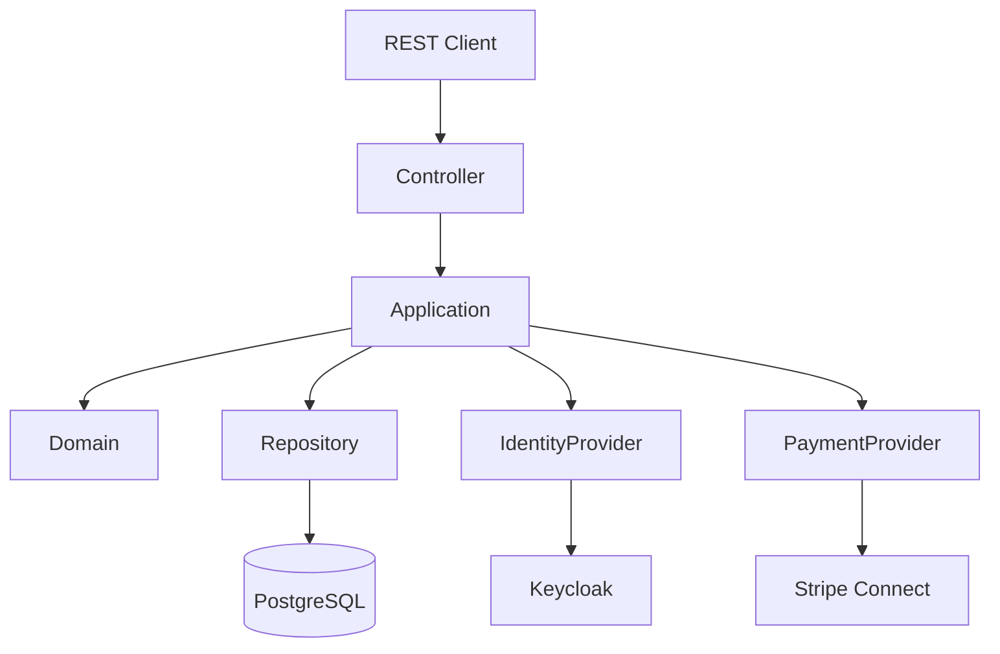

# Application Architecture

## Overview

The User Service follows a layered architecture with a rich domain model and integrates with external systems through application ports.

## Layers

### REST Layer

Responsible for exposing HTTP APIs.

Maps HTTP requests into application commands and queries.

---

### Application Layer

Coordinates use cases.

Responsible for orchestration only.

Contains no infrastructure code.

---

### Domain Layer

Contains the Merchant aggregate and business rules.

No dependency on Spring or infrastructure.

---

### Infrastructure Layer

Implements adapters for

- PostgreSQL
- Stripe
- Keycloak