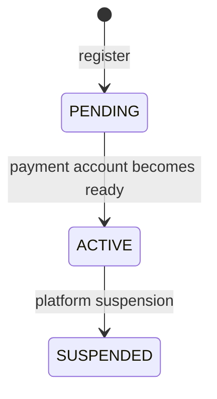
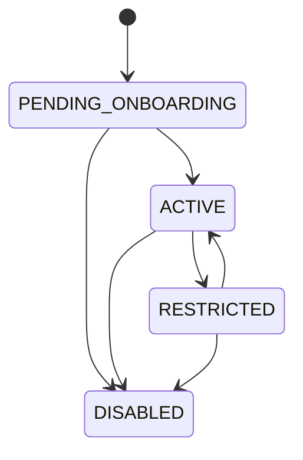

# Merchant lifecycle

Merchant business lifecycle and Stripe payment-account lifecycle are related
but stored separately.

## Merchant status



| Status | Meaning |
|---|---|
| `PENDING` | Merchant exists but is not yet activated |
| `ACTIVE` | Merchant has linked identity/payment accounts and passed readiness policy |
| `SUSPENDED` | Platform has disabled the merchant |

Activation is driven by a Stripe `account.updated` webhook after the normalized
payment-account state becomes active.

## Payment-account status



| Status | Meaning |
|---|---|
| `PENDING_ONBOARDING` | Stripe onboarding or requirements are incomplete |
| `ACTIVE` | Account satisfies User Service activation policy |
| `RESTRICTED` | Existing account has a recoverable provider restriction |
| `DISABLED` | Account has a terminal/support-managed restriction |

## Required action

| Action | Meaning |
|---|---|
| `CONTINUE_ONBOARDING` | Merchant should request a fresh Stripe onboarding link |
| `WAIT_FOR_REVIEW` | Stripe verification is pending |
| `CONTACT_SUPPORT` | Manual support intervention is required |
| `NONE` | No payment-account action is required |

Required action is derived from normalized Stripe requirements. Other services
must not interpret raw Stripe `disabled_reason` values independently.

## Readiness policy

```text
readyForPayments =
    merchant status is ACTIVE
    and payment account status is ACTIVE

eligibleForDestinationCharges =
    readyForPayments
    and transfers capability is active
```

`card_payments` capability is tracked independently and does not currently gate
destination-charge eligibility.

## Provider snapshots and events

Every successfully applied Stripe snapshot advances Merchant `revision`,
including snapshots that leave normalized business state unchanged.

A `MerchantPaymentStateChanged` domain event is created only when at least one
of these values changes:

- payment-account status;
- required action;
- readiness for payments;
- destination-charge eligibility.

This prevents technical Stripe webhook noise from becoming integration-event
noise.

Older Stripe snapshots are ignored using `lastPaymentAccountEventAt`. Equal
provider timestamps are processed in committed order because Stripe timestamps
have limited precision.
