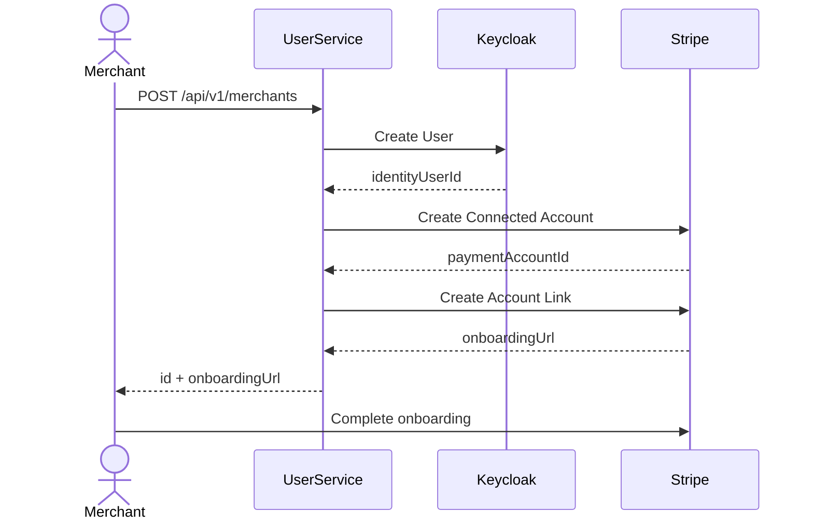

# Merchant Registration Sequence

```mermaid
sequenceDiagram

actor Merchant

participant UserService

participant Keycloak

participant Stripe

Merchant->>UserService: POST /api/v1/merchants

UserService->>Keycloak: Create User

Keycloak-->>UserService: identityUserId

UserService->>Stripe: Create Connected Account

Stripe-->>UserService: paymentAccountId

UserService->>Stripe: Create Account Link

Stripe-->>UserService: onboardingUrl

UserService-->>Merchant: id + onboardingUrl

Merchant->>Stripe: Complete onboarding
```

## Notes

Merchant remains **PENDING** after registration.

Activation is performed asynchronously through Stripe webhooks.