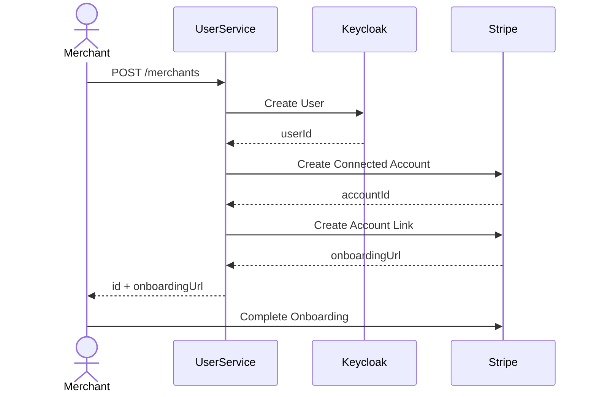

# Merchant Registration

```mermaid
sequenceDiagram

actor Merchant

participant UserService

participant Keycloak

participant Stripe

Merchant->>UserService: POST /merchants

UserService->>Keycloak: Create User

Keycloak-->>UserService: userId

UserService->>Stripe: Create Connected Account

Stripe-->>UserService: accountId

UserService->>Stripe: Create Account Link

Stripe-->>UserService: onboardingUrl

UserService-->>Merchant: id + onboardingUrl

Merchant->>Stripe: Complete Onboarding
```

## Notes

Merchant remains **PENDING** until Stripe confirms successful onboarding.