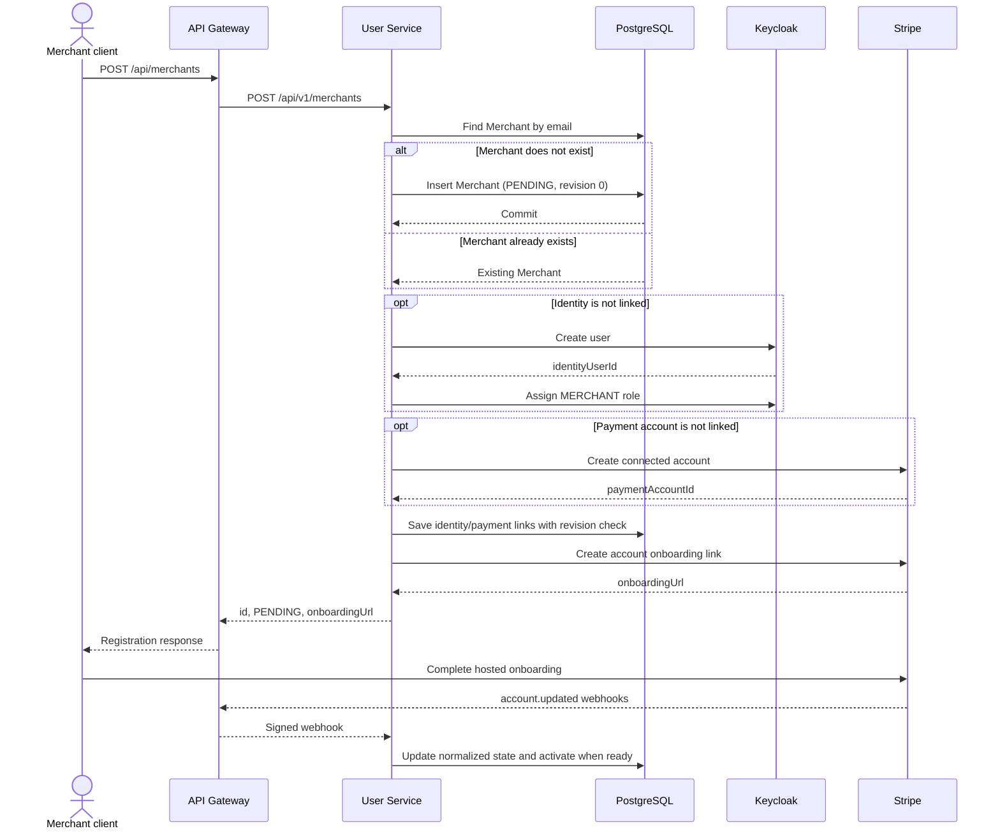

# Merchant registration and onboarding

## Properties

- Registration is idempotent by merchant email at the application boundary.
- Merchant remains `PENDING` until Stripe webhook state satisfies activation
  policy.
- Stripe account links are short-lived; an eligible authenticated merchant can
  request a fresh link through
  `POST /api/merchants/me/payment-account/onboarding-link`.
- Keycloak passwords, action links and Stripe onboarding links are never
  published to Kafka.
- Current external provisioning compensation is best effort; durable recovery
  is handled by the reliability plan.
