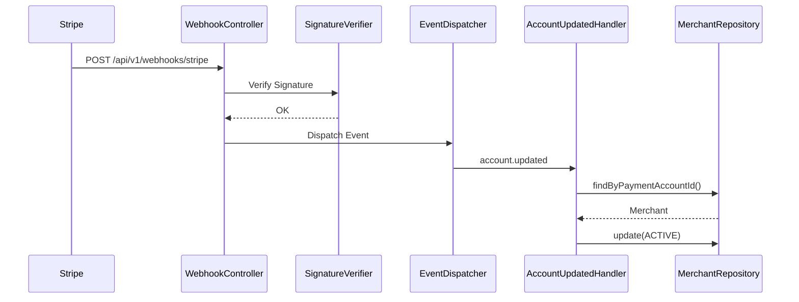

# Stripe Webhook Processing

## Processing Steps

1. Verify Stripe webhook signature.
2. Validate timestamp.
3. Deserialize webhook payload.
4. Dispatch event.
5. Execute matching event handler.
6. Activate merchant.