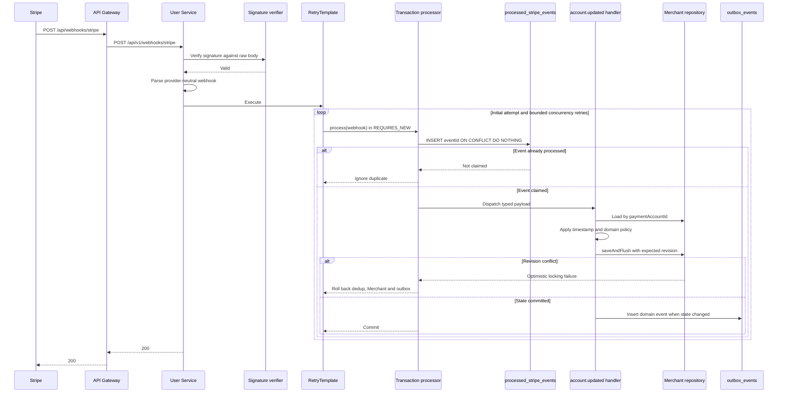
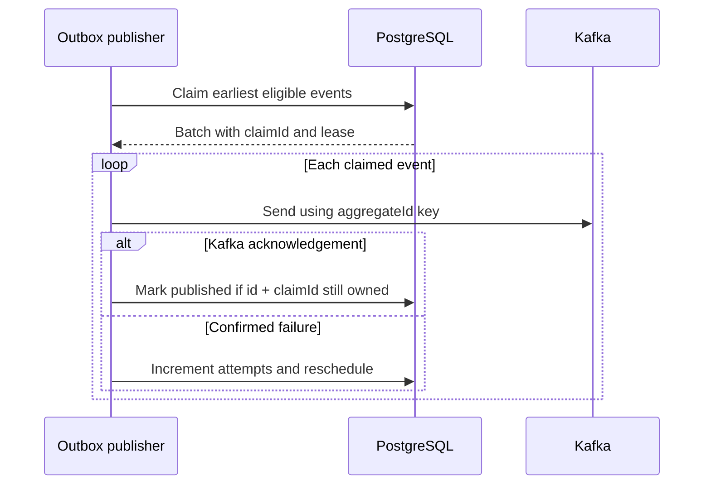

# Stripe webhook processing

## Request and transaction flow

## Processing rules

1. API Gateway permits unauthenticated access only to the Stripe webhook route.
2. User Service verifies the Stripe signature using the unmodified request
   payload.
3. Only supported provider events are dispatched.
4. `processed_stripe_events.event_id` provides durable deduplication.
5. Unknown payment accounts are logged and safely ignored.
6. Older account snapshots are ignored.
7. Merchant persistence uses JPA optimistic locking on `revision`.
8. A concurrency conflict rolls back the complete attempt and `RetryTemplate`
   reloads state in a new transaction.
9. Merchant state and outbox events commit atomically.
10. Provider-specific requirements are normalized before leaving User Service.

## Asynchronous publication

Publication is at least once and runs outside the business transaction. Later
events of one merchant cannot bypass an unpublished predecessor, including an
exhausted head event. Other merchants remain independent.

The public wire contract is documented in
[`merchant-payment-account-status-changed-v1.md`](../../contracts/kafka/merchant-payment-account-status-changed-v1.md).
